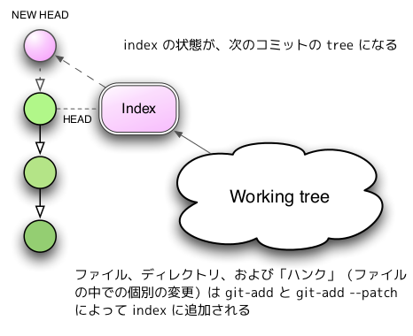

!SLIDE 
# インデックス

## .git/index

!SLIDE bullet incremental
## .git/index
* 次のコミットの準備をする場所
* バイナリファイルにパス、パーミッション、blob 値をもつ
* 次の HEAD になる commit を生成するためのエリア

!SLIDE small
# .git/index は tree の鋳型

[Git をボトムアップから理解する](http://keijinsonyaban.blogspot.jp/2011/05/git.html)より引用
