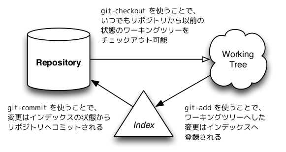

!SLIDE 
# リポジトリ

## .git

!SLIDE
## git の基本構成要素
### .git は working tree 以外の情報全てをもつ

[Git をボトムアップから理解する](http://keijinsonyaban.blogspot.jp/2011/05/git.html)より引用

!SLIDE commandline incremental small
# リポジトリの作成
	$ mkdir sandbox && cd sandbox
	$ git init
	$ tree .git
	.git
	├── HEAD # 現在チェックアウトしてるブランチ
	├── config
	├── description
	├── hooks
	│   └─各種 hook スクリプト
	├── info
	│   └── exclude
	├── objects # オブジェクトデータベース
	│   ├── info
	│   └── pack
	└── refs # リファレンス(ブランチ, タグなど)
	    └── heads
	        └── tags
